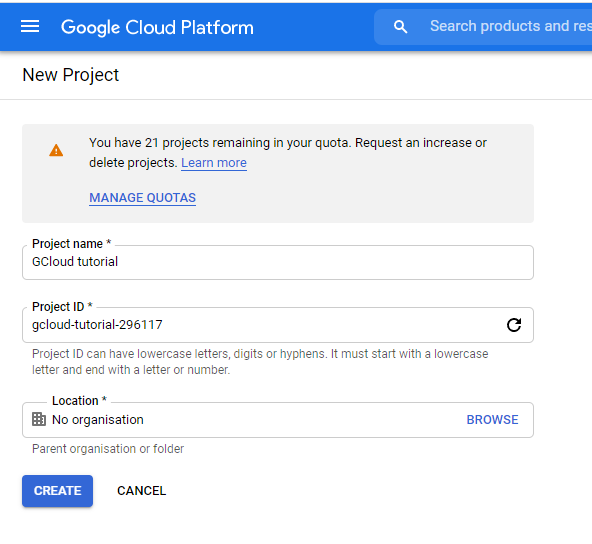
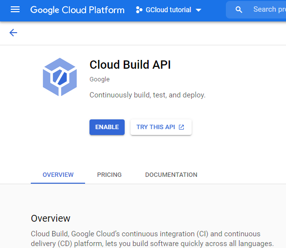
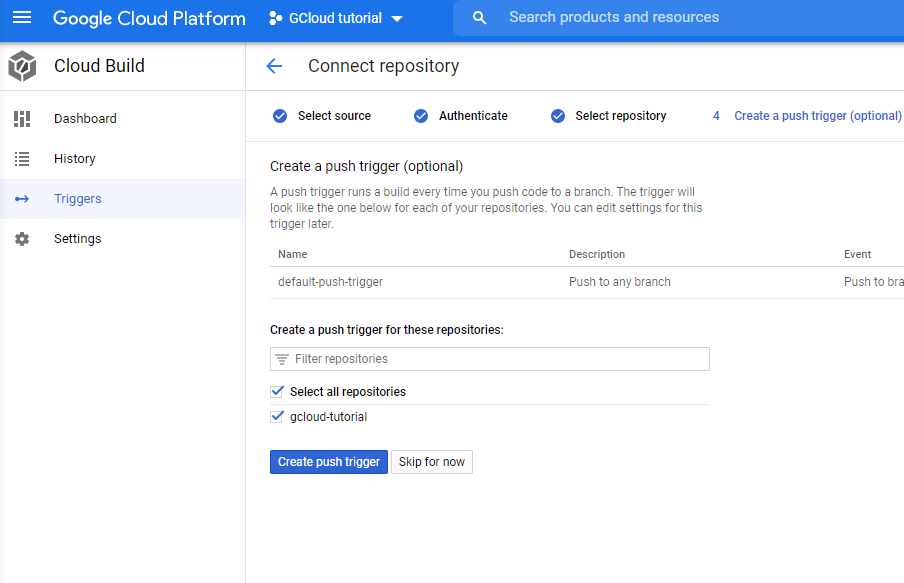
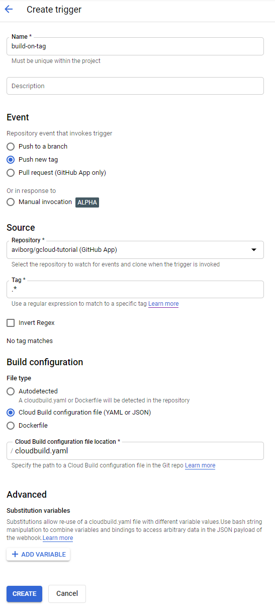
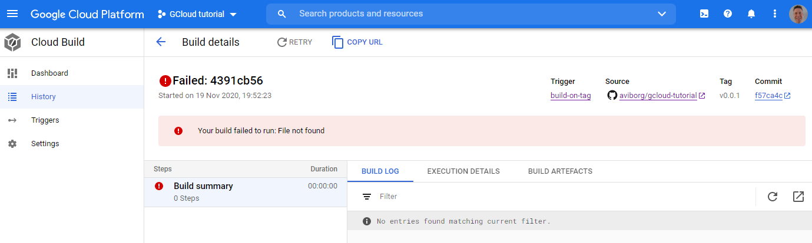

# gcloud-tutorial
An attempt to do some fancy stuff with Google cloud continous integration

# Create the Google Cloud Build functions
First, create a project on Google cloud platform. Name it GCloud tutorial.



Then enable the Cloud Build API



Goto the Cloud Build tab and select triggers. First, connect your repository on github. Don't create a push trigger here and select **Skip for now** on step 4.



Then click on **Create Trigger**, give it a name, select *Push new tag*, connect your repository, when the tag edit box is selected various choices will show and specify that your build recipe will be specified in a cloudbuild.yaml file.


## The cloud build recipe
Now create a cloudbuild.yaml file with the following content:
```yaml
steps:
- name: 'sglahn/platformio-core:latest'  
  dir: .
  args: ['--version']
```
When a tag is pushed to the github repository this file will be used. The first argument *name* specifies the image to use, which in this case is a public platformio docker image. A full path may be used to fetch an image from any repository, but in this case an the latest platformio-core image will be fetched from Docker Hub.

Make a git commit and push.

You may check the History tab under Cloud Build, it should be empty as no tags are yet created.

Now create a git tag v0.0.1, commit and push. ``git push --tags``

Oops, seems like I forgot to add the *cloudbuild.yaml* file!



Add and commit the *cloudbuild.yaml* file, then make a second tag v0.0.2 and push it to the repo.
