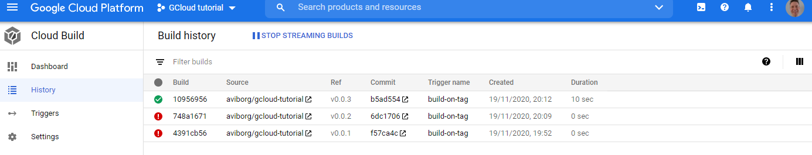
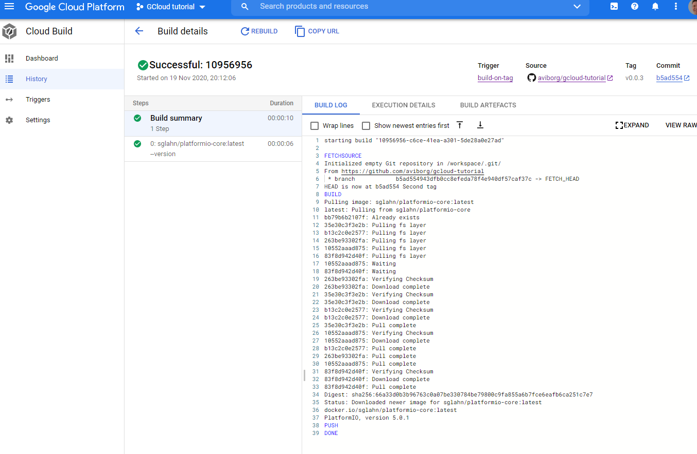
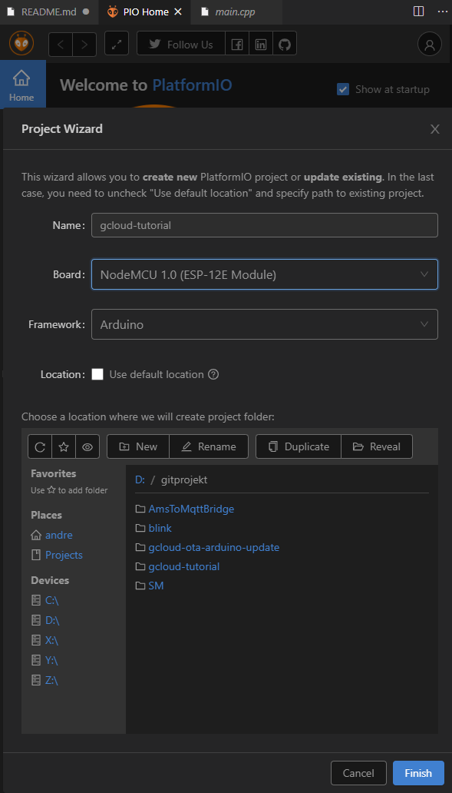
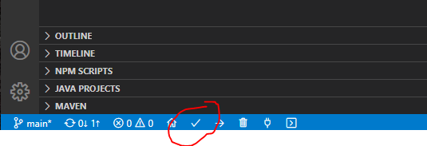
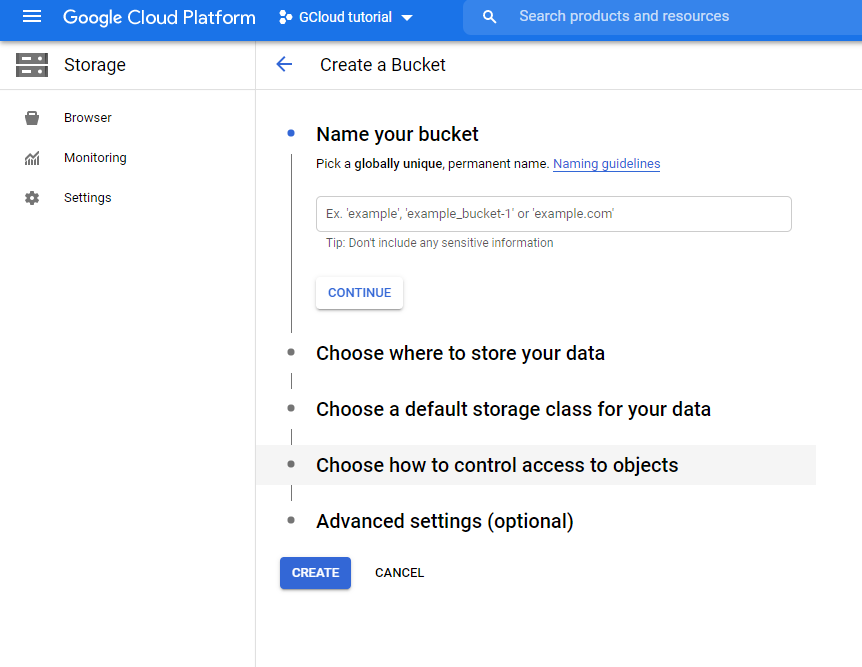

# gcloud-tutorial
An attempt to do some fancy stuff with Google cloud continous integration.

This file is also a log on the steps I made. Compare the different tags to see the changes.

# Create the Google Cloud Build functions
First you need to sign up for a Google cloud account, it should be self-explanatory.
Then create a new project on Google cloud platform. Name it GCloud tutorial.


Then enable the Cloud Build API


Goto the Cloud Build tab and select triggers. First, connect your repository on github. Don't create a push trigger here and select **Skip for now** on step 4.


Then click on **Create Trigger**, give it a name, select *Push new tag*, connect your repository, when the tag edit box is selected various choices will show and specify that your build recipe will be specified in a cloudbuild.yaml file.


## The cloud build recipe
Now create a cloudbuild.yaml file with the following content:
```yaml
steps:
- name: 'sglahn/platformio-core:latest'  
  dir: .
  args: ['--version']
```
When a tag is pushed to the github repository this file will be used. The first argument *name* specifies the image to use, which in this case is a public platformio docker image. A full path may be used to fetch an image from any repository, but in this case the latest platformio-core image will be fetched from Docker Hub.

Make a git commit and push.

You may check the History tab under Cloud Build, it should be empty as no tags are yet created.

Now create a git tag v0.0.1, commit and push. ``git push --tags``

Oops, seems like I forgot to add the *cloudbuild.yaml* file!


Add and commit the *cloudbuild.yaml* file, then make a second tag v0.0.2 and push it to the repo.

Aargh, I forgot to commit cloudbuild.yaml file before I made the tag. A third tag is needed. Now head over to Google Cloud and check the build history:



Finally a successful build! Click on the build number to see the details:


Lines 1 to 36 are just the setup of the docker image, then on line 37 the output from the ``--version`` argument is shown. Then the build process finish up on lines 38-39.

# Creating artifacts

The next step is to have the Google cloud to build something useful. For this project I have chosen to use Google Cloud to build firmware for an IoT-device, an ESP8266 module using the PlatformIO framework. I will use this together with the Visual Studio Code editor.

## Prerequisites
Install Visual Studio Code and the PlatformIO IDE. Instructions are here:
[https://docs.platformio.org/en/latest/integration/ide/vscode.html#ide-vscode]

You probably need Python installed too... not sure as I already had it when I started this tutorial.

## Setup the simple blink project

Open the PlatformIO Home on Visual Studio Code and select New project. Name as the Google Cloud project already started: gcloud-tutorial

Set location to folder to the one containing the existing folder. This will add the PlatformIO files needed to this folder.


Select the board type you may have.

Also edit the .gitignore file to ignore some additional folders:
```
.pio
.pioenvs
.piolibdeps
.vscode
```
Write the blink program to *src/main.cpp*:
```cpp
#include <Arduino.h>

void setup() {
  pinMode(LED_BUILTIN, OUTPUT);     // Initialize the LED_BUILTIN pin as an output
}

void loop() {
    digitalWrite(LED_BUILTIN, LOW);     // Turn the LED on (Note that LOW is the voltage level
                                        // but actually the LED is on; this is because 
                                        // it is acive low on the ESP)
    delay(1000);                        // Wait for a second
    digitalWrite(LED_BUILTIN, HIGH);    // Turn the LED off by making the voltage HIGH
    delay(2000);                        // Wait for two seconds (to demonstrate the active low LED)
}
```

Compile the code:



This will create a *firmware.bin* file that contains the binary image to be uploaded to the MCU.

(Note: it is not necessary to upload the code to the MCU at this stage.)

If it is succesful, then let's try to build the code on Google Cloud!

## Cloud build

The first thing is to create a bucket (file storage) where the binary files can be stored on Google cloud platform.

Create a bucket named *gcloud-tutorial-firmwares*

 

Next the *cloudbuild.yaml* file needs to be updated to build and then copy the *firmware.bin* file to our bucket with a subfoldername as the current tag:
```yaml
steps:
- name: 'sglahn/platformio-core:latest'  
  dir: .
  args: ['run']  
artifacts: 
  objects: 
    location: 'gs://$gcloud-tutorial-firmwares/$TAG_NAME'
    paths: ['/workspace/.pio/build/nodemcuv2/firmware.bin']
```